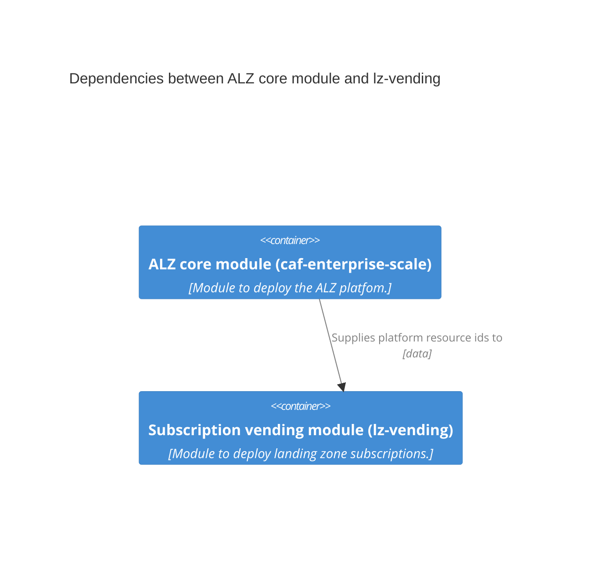

<!-- markdownlint-disable MD041 -->
This module has been designed to integrate well with the [ALZ Terraform module](https://aka.ms/alz/tf).
The below example steps through a sample configuration.

## ALZ module

In the below sample, `strict_subscription_association` is set to `false`. This means that the ALZ module is not authoritative for each subscription that is a member of a management group that it created. The result is that the lz-vending module can add subscriptions to these management groups and the ALZ module will not attempt to remove them.

### Avoiding circular dependencies

We recommend that you only create dependencies between the ALZ module and the lz-vending module in one direction.
Typically this would be that the lz-vending module depends on the ALZ module, for example to supply the resource IDs for the vWAN hubs or the hub virtual networks.

Creating a dependency in the other direction, for example to supply the resource IDs for the virtual networks to the ALZ module (for the `spoke_network_resource_ids` value in the hub network configuration), can lead to circular dependencies.
Instead we recommend using the lz-vending module to create the central resources, e.g. peerings.
If the lz-vending module is not able to meet your requirements, then please open a [feature request](https://github.com/Azure/terraform-azurerm-lz-vending/issues/new/choose).



### Example

```terraform
module "alz" {
  source  = "Azure/caf-enterprise-scale/azurerm"
  version = "<version>" # change this to your desired version, https://www.terraform.io/language/expressions/version-constraints

  providers = {
    azurerm              = azurerm
    azurerm.connectivity = azurerm.connectivity
    azurerm.management   = azurerm.management
  }

  root_parent_id = data.azurerm_client_config.core.tenant_id
  root_id        = var.root_id
  root_name      = var.root_name

  deploy_corp_landing_zones   = true
  deploy_online_landing_zones = true

  default_location = "northeurope"

  // Set subscription IDs for placement of platform subs
  subscription_id_management   = data.azurerm_client_config.management.subscription_id
  subscription_id_connectivity = data.azurerm_client_config.connectivity.subscription_id

  // Use management group association instead of having to be explicit about MG membership
  strict_subscription_association = false

  // Custom Landing Zone created as an example.
  custom_landing_zones = {
    mymg = {
      display_name               = "MyMg"
      parent_management_group_id = "${var.root_id}-landing-zones"
      subscription_ids           = []
      archetype_config = {
        archetype_id   = "default_empty"
        parameters     = {}
        access_control = {}
      }
    }
  }

  // Management resources
  deploy_management_resources = true
  configure_management_resources = {
    advanced = null
    location = ""
    settings = {
      log_analytics = {
        config = {
          enable_monitoring_for_arc                         = true
          enable_monitoring_for_vm                          = true
          enable_monitoring_for_vmss                        = true
          enable_sentinel                                   = true
          enable_solution_for_agent_health_assessment       = true
          enable_solution_for_anti_malware                  = true
          enable_solution_for_azure_activity                = true
          enable_solution_for_change_tracking               = true
          enable_solution_for_service_map                   = true
          enable_solution_for_sql_advanced_threat_detection = true
          enable_solution_for_sql_assessment                = true
          enable_solution_for_sql_vulnerability_assessment  = true
          enable_solution_for_updates                       = true
          enable_solution_for_vm_insights                   = true
          retention_in_days                                 = 30
        }
        enabled = true
      }
      security_center = {
        config = {
          email_security_contact             = "email@domain.com"
          enable_defender_for_app_services   = true
          enable_defender_for_arm            = true
          enable_defender_for_containers     = true
          enable_defender_for_dns            = true
          enable_defender_for_key_vault      = true
          enable_defender_for_oss_databases  = true
          enable_defender_for_servers        = true
          enable_defender_for_sql_server_vms = true
          enable_defender_for_sql_servers    = true
          enable_defender_for_storage        = true
        }
        enabled = true
      }
    }
    tags = null
  }

  // Connectivity (hub network) configuration
  deploy_connectivity_resources = false
  configure_connectivity_resources = {
    advanced = null
    location = ""
    settings = {
      ddos_protection_plan = {
        config = {
          location = ""
        }
        enabled = false
      }
      dns = {
        config = {
          enable_private_dns_zone_virtual_network_link_on_hubs   = false
          enable_private_dns_zone_virtual_network_link_on_spokes = false
          enable_private_link_by_service = {
            azure_app_configuration_stores       = false
            azure_automation_dscandhybridworker  = false
            azure_automation_webhook             = false
            azure_backup                         = false
            azure_cache_for_redis                = false
            azure_container_registry             = false
            azure_cosmos_db_cassandra            = false
            azure_cosmos_db_gremlin              = false
            azure_cosmos_db_mongodb              = false
            azure_cosmos_db_sql                  = false
            azure_cosmos_db_table                = false
            azure_data_factory                   = false
            azure_data_factory_portal            = false
            azure_data_lake_file_system_gen2     = false
            azure_database_for_mariadb_server    = false
            azure_database_for_mysql_server      = false
            azure_database_for_postgresql_server = false
            azure_event_grid_domain              = false
            azure_event_grid_topic               = false
            azure_event_hubs_namespace           = false
            azure_file_sync                      = false
            azure_iot_hub                        = false
            azure_key_vault                      = false
            azure_kubernetes_service_management  = false
            azure_machine_learning_workspace     = false
            azure_monitor                        = false
            azure_relay_namespace                = false
            azure_search_service                 = false
            azure_service_bus_namespace          = false
            azure_site_recovery                  = false
            azure_sql_database_sqlserver         = false
            azure_synapse_analytics_sql          = false
            azure_synapse_analytics_sqlserver    = false
            azure_web_apps_sites                 = false
            cognitive_services_account           = false
            signalr                              = false
            storage_account_blob                 = false
            storage_account_file                 = false
            storage_account_queue                = false
            storage_account_table                = false
            storage_account_web                  = false
          }
          location               = ""
          private_dns_zones      = []
          private_link_locations = []
          public_dns_zones       = []
        }
        enabled = false
      }
      hub_networks = [{
        config = {
          address_space = ["10.0.0.0/23"]
          azure_firewall = {
            config = {
              address_prefix = ""
              availability_zones = {
                zone_1 = false
                zone_2 = false
                zone_3 = false
              }
              base_policy_id                = ""
              dns_servers                   = []
              enable_dns_proxy              = false
              private_ip_ranges             = []
              sku_tier                      = ""
              threat_intelligence_allowlist = []
              threat_intelligence_mode      = ""
            }
            enabled = false
          }
          bgp_community                           = ""
          dns_servers                             = []
          enable_hub_network_mesh_peering         = false
          enable_outbound_virtual_network_peering = false
          link_to_ddos_protection_plan            = false
          location                                = ""
          spoke_virtual_network_resource_ids      = []
          subnets = [{
            address_prefixes          = ["10.0.0.0/24"]
            name                      = "default"
            network_security_group_id = ""
            route_table_id            = ""
          }]
          virtual_network_gateway = {
            config = {
              address_prefix = ""
              advanced_vpn_settings = {
                active_active                    = false
                bgp_settings                     = []
                custom_route                     = []
                default_local_network_gateway_id = ""
                enable_bgp                       = false
                private_ip_address_allocation    = ""
                vpn_client_configuration         = []
              }
              gateway_sku_expressroute = "value"
              gateway_sku_vpn          = "value"
            }
            enabled = false
          }
        }
        enabled = true
      }]
      vwan_hub_networks = []
    }
    tags = null
  }
}
```

## Locals

This local makes it easier to get the resource id of the hub network from the ALZ module outputs.

```terraform
locals {
  hub_networks_by_location = {
    for i, v in module.alz.azurerm_virtual_network.connectivity :
    v.location => v
  }
}
```

## lz-vending module

Here we create a single landing zone using the outputs from the ALZ module.
Note use of the local in `hub_network_resource_id`.

```terraform
module "lz_vending" {
  source  = "Azure/lz-vending/azurerm"
  version = "<version>" # change this to your desired version, https://www.terraform.io/language/expressions/version-constraints

  location = "northeurope"

  # subscription variables
  subscription_alias_enabled = true
  subscription_billing_scope = "/providers/Microsoft.Billing/billingAccounts/1234567/enrollmentAccounts/123456"
  subscription_display_name  = "mysub"
  subscription_alias_name    = "mysub"
  subscription_workload      = "Production"

  # management group association variables
  subscription_management_group_association_enabled = true
  subscription_management_group_id                  = "mymg"

  # virtual network variables
  virtual_network_enabled = true
  virtual_networks = {
    vnet1 = {
      name                    = "spoke"
      address_space           = ["192.168.2.0/24"]
      resource_group_name     = "rg-networking"
      hub_peering_enabled     = true
      hub_network_resource_id = local.hub_networks_by_location["northeurope"].id
    }
  }
}
```

Back to [Examples](Examples)
