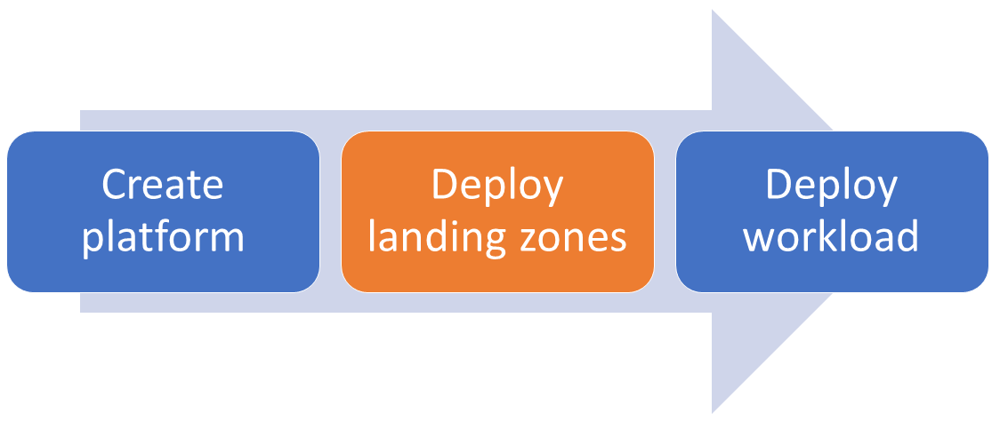

<!-- markdownlint-disable MD041 -->
Welcome to the lz-vending module documentation.

Please see the [README][readme] for information on module requirements, variables and outputs.
This wiki contains longer form documentation.

This module can be used standalone, or combined with the [Azure Landing Zones Terraform module][alz_tf_module] to create a landing zone within the [Azure Landing Zones conceptual architecture][alz_conceptual_arch].

<!-- markdownlint-disable MD033 -->

<!-- markdownlint-enable -->

In the above diagram, this module provides the capability to deploy landing zones
(subscriptions) and the core resources, e.g. networking.

We recommend that you deploy the platform using the [Azure Landing Zones Terraform module][alz_tf_module]
and then use this module to deploy the landing zones.

Before deployment, please review the [required permissions](Permissions) and [provider configuration](Provider-configuration).
Then to get started, look at one of the [examples](Examples).

[alz_conceptual_arch]: https://docs.microsoft.com/azure/cloud-adoption-framework/ready/landing-zone/#azure-landing-zone-conceptual-architecture
[alz_tf_module]: https://aka.ms/alz/tf
[readme]: https://github.com/Azure/terraform-azurerm-lz-vending#readme
